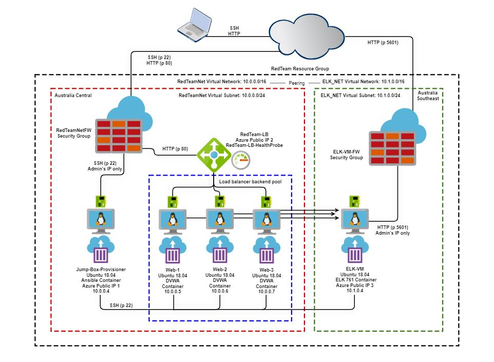

## Automated ELK Stack Deployment

The files in this repository were used to configure the network depicted below. 

These files have been tested and used to generate a live ELK deployment on Azure. They can be used to either recreate the entire deployment pictured above. Alternatively, select portions of the main.yml file may be used to install only certain pieces of it, such as Filebeat.

This document contains the following details:
- Description of the Topology
- Access Policies
- ELK Configuration
  - Beats in Use
  - Machines Being Monitored
- How to Use the Ansible Build

### Description of the Topology

The main purpose of this network is to expose a load-balanced and monitored instance of DVWA, the D*mn Vulnerable Web Application.

Load balancing ensures that the application will be highly available, in addition to restricting access to the network.

Integrating an ELK server allows users to easily monitor the vulnerable VMs for changes to the files and system processes.

The configuration details of each machine may be found below:

| Name                 | Function  | IP Address | Operating System     |
|----------------------|-----------|------------|----------------------|
| Jump-Box-Provisioner | Gateway   | 10.0.0.4   | Linux (Ubuntu 18.04) |
| Web-1                | Webserver | 10.0.0.5   | Linux (Ubuntu 18.04) |
| Web-2                | Webserver | 10.0.0.6   | Linux (Ubuntu 18.04) |
| Web-3                | Webserver | 10.0.0.7   | Linux (Ubuntu 18.04) |
| ELK-VM               | ELK stack | 10.1.0.4   | Linux (Ubuntu 18.04) |

### Access Policies

The machines on the internal network are not exposed to the public Internet. 

Only the JumpHost machine (Jump-Box-Provisioner) can accept connections from the Internet. Access to this machine is only allowed from whitelisted IP addresses.
- For the purpose of this project my personal public IP address was the only whitelisted IP, however for someone setting this up themselves, add your own and add any others at your descretion.

Machines within the network can only be accessed by Jump-Box-Provisioner.

A summary of the access policies in place can be found in the table below:

| Name                 | Publicly Accessible | Allowed IP Addresses           |
|----------------------|---------------------|--------------------------------|
| Jump-Box-Provisioner | Yes                 | Set personal public IP address |
| Web-1                | No                  | 10.0.0.4                       |
| Web-2                | No                  | 10.0.0.4                       |
| Web-3                | No                  | 10.0.0.4                       |
| ELK-VM               | No                  | 10.0.0.4                       |

### Elk Configuration

Ansible was used to automate configuration of the ELK machine. No configuration was performed manually, which is advantageous because it can be setup quickly and accurately multiple times.

The playbook implements the following tasks:
- Installs docker.io
- Installs python3-pip
- Increases the virtual memory limit on the ELK VM
- Installs the ELK Docker container and maps the ports
- Enables the docker service

The following screenshot displays the result of running `docker ps` after successfully configuring the ELK instance.

### Target Machines & Beats
This ELK server is configured to monitor the following machines:

| Web-1  | 10.0.0.5
| Web-2  | 10.0.0.6
| Web-3  | 10.0.0.7

We have installed the following Beats on these machines:
- Filebeat
- Metricbeat

These Beats allow us to collect the following information from each machine:

- Filebeat collects and forwards log files, such as SSH logins and sudo commands, for Linux/Unix based servers, which can be used to monitor for suspicious/unauthorised behaviour.
- Metricbeat collects system metrics such as cpu and memory usage, which can be used to monitor the performance and health of your servers.

### Using the Playbook
In order to use the playbook, you will need to have an Ansible control node already configured. Assuming you have such a control node provisioned: 

SSH into the control node and follow the steps below:

- Create the following directory structure in /etc/ansible/
- Copy all the yaml files listed below into their respective directories
- This can be done quickly and accurately by downloading and running the script [roles_setup] in the script folder of this repository.

- To download this script, run the following command within your Ansible container:
curl -LJO https://raw.githubusercontent.com/Marsh-A/Cyber-Security-Bootcamp-Portfolio/master/Azure%20Cloud%20Project/Scripts/roles_setup

File structure for /etc/ansible/
├── ansible.cfg
├── hosts
├── main.yml
└── roles
    ├── install-elk
    │   ├── files
    │   └── tasks
    │       └── install-elk.yml
    ├── install-filebeat
    │   ├── files
    │   │   └── filebeat-config.yml
    │   └── tasks
    │       └── install-filebeat.yml
    └── install-metricbeat
        ├── files
        │   └── metricbeat-config.yml
        └── tasks
            └── install-metricbeat.yml

- Update the ansible.cfg file:
       Change the remote user on line 107 to the user setup on the VM's
       remote_user = <username_on_VM>

- Update the hosts file to include all your VM's:
      [elk]
      <ELK VM IP> ansible_python_interpreter=/usr/bin/python3
      [webservers]
      <Web VM 1 IP> ansible_python_interpreter=/usr/bin/python3
      <Web VM 2 IP> ansible_python_interpreter=/usr/bin/python3
      <Web VM 3 IP> ansible_python_interpreter=/usr/bin/python3  

-Update the filebeat-config.yml:
    - Change IP address on line 1106 to the IP address of the ELK VM
    - Change IP address on line 1806 to the IP address of the ELK VM

-Update the metricbeat-config.yml:
    - Change IP address on line 62 to the IP address of the ELK VM
    - Change IP address on line 95 to the IP address of the ELK VM

- Run the main.yml playbook, and navigate to <ELK_VM_PUBLIC_IP>:6051 to check that the installation worked as expected.
    ansible-playbook main.yml

